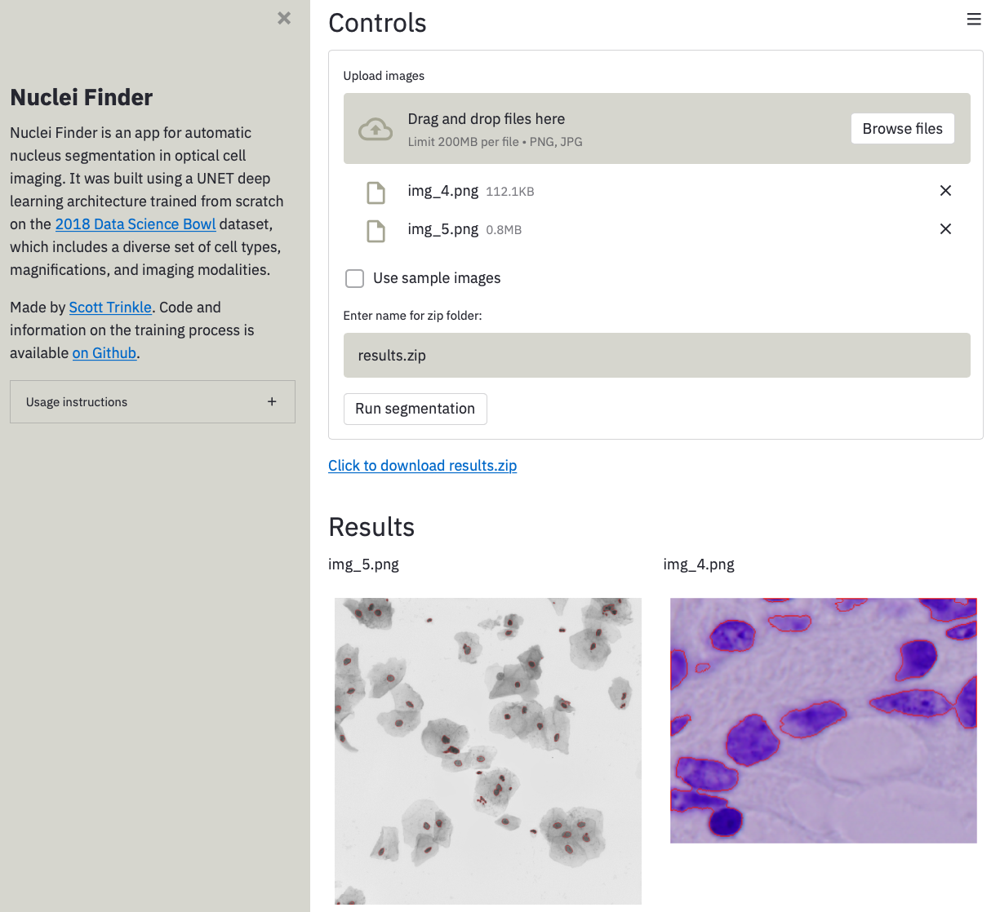

# Nuclei Finder



Nuclei Finder is a [Streamlit](https://streamlit.io) app for automatic nucleus
segmentation in optical cell imaging. It was built using a UNET deep learning
architecture trained from scratch on the [2018 Data Science
Bowl](https://www.kaggle.com/c/data-science-bowl-2018/overview) dataset, which
includes a diverse set of cell types, magnifications, and imaging modalities.

## Approach
- Used corrected training data from [here](https://github.com/lopuhin/kaggle-dsbowl-2018-dataset-fixes)
- Trained with stage1 test data from original competition
- Stratified training and validation sets using image [class
  labels](https://www.kaggle.com/c/data-science-bowl-2018/discussion/48130)
- Decomposed training set images into overlapping tiles of size 128x128
- [UNET](https://en.wikipedia.org/wiki/U-Net) architecture
- Used early stopping based on validation loss

Additional information about the model is found in `Train UNET.ipynb`.

## Installation

### Web

Nuclei Finder is deployed with Heroku at
[https://nuclei-finder.herokuapp.com/](https://nuclei-finder.herokuapp.com/)

### Local

Clone the repository: 

```
git clone https://github.com/scott-trinkle/nuclei-finder
```

Create a virtual environment with conda:

```
conda env create -f environment.yml
```

Activate virtual environment:

```
conda activate nuclei
```

Run app with Streamlit:

```
cd nuclei-finder
streamlit run app.py
```
